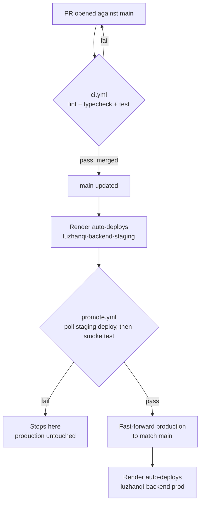

# Contributing to luzhanqi-backend

## Workflow

1. Branch off `main` (`type/short-description`, e.g. `fix/reconnect-token`,
   `feat/rule-variant`, `chore/dep-bump`, `docs/...`).
2. Open a PR into `main`. CI (`.github/workflows/ci.yml`: lint, typecheck,
   `npm test`) must pass — it's a required status check, so the merge
   button stays disabled until it's green.
3. Use [Conventional Commits](https://www.conventionalcommits.org/)
   (`feat:`, `fix:`, `refactor:`, `test:`, `docs:`, `chore:`, optionally
   with a scope) for commit messages and PR titles.
4. Merge (this repo uses merge commits, not squash/rebase, so `git log`
   keeps a per-PR merge commit).

That's it from a contributor's side — everything after merge is automatic:

`main` is the staging trigger, `production` is the prod trigger — never
push directly to `production`, since only `promote.yml`'s fast-forward
should ever move it. The smoke test hits `GET /health` (expects 200) and
`GET /games/<a well-formed but nonexistent id>` (expects 404, proving the
Express↔Mongoose round-trip works) against staging before promoting; if
either fails, prod simply stays on its last good commit.

## Local development

- `docker compose up` — MongoDB + the app together, bind-mounted so edits
  take effect via `npm run dev`'s auto-restart. See `README.md` for the
  required `.env`.
- `npm test` — Jest; there's no DB-backed test infra, so anything touching
  `controllers/`/`services/gameplayService.ts`'s DB-facing functions needs
  manual verification against a real `docker compose up` instance, not just
  `npm test`.
- `npx tsc --noEmit` / `npm run lint` — same checks CI runs, useful to run
  locally before pushing.

## Getting oriented

- `src/server.ts` — HTTP + socket.io bootstrap, CORS allowlist.
- `src/lzqgame.ts` — all socket.io event handlers (join/rejoin/move/setup/
  AI turns); also owns the auth/ownership checks for socket events.
- `src/services/gameplayService.ts` — socket-free move/setup application
  (`applyMove`, `submitInitialBoard`, `pieceMovement`) reused by both real
  players and the AI's own turns. Prefer adding new gameplay logic here
  over `lzqgame.ts` so it stays testable without a socket.
- `src/controllers/` — Mongoose DB access (`gameController.ts`,
  `userController.ts`).
- `src/utils/` — pure, socket/DB-free functions: board/piece primitives,
  move generation (`getSuccessors.ts`), setup validation, fog-of-war
  redaction, the AI opponent.
- The client sends a Firebase ID token (never a raw uid) wherever caller
  identity matters; the server verifies it before trusting anything.
  Anonymous play is allowed — a missing token is fine, a *present but
  invalid* one is treated as an error, never silently downgraded to
  anonymous.
- A rule-variant change must stay in sync across `pieceMovement`/
  `getSuccessors.ts` (server truth), `aiPlayer.ts` (so the AI doesn't
  misjudge outcomes under a variant it doesn't know about), and the
  frontend's `predictOutcome.js`/`getSuccessors.js` mirrors.
